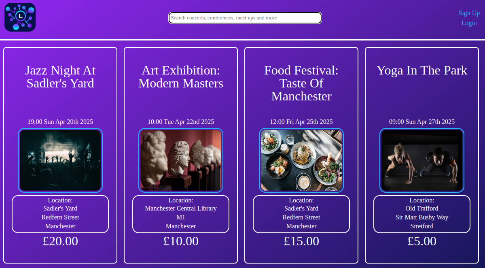

# [LocalLink FE](#)

<!-- TODO add screenshot -->


## Summary

**Hosted API** [LocalLink](https://locallink-fe.netlify.app/)

LocalLink is a dynamic event management platform that allows users to discover, sign up for, and manage events. Users can also set event reminders in their Google Calendar. This project follows RESTful API principles, ensuring full CRUD functionality (Create, Read, Update, Delete) while providing an intuitive user experience.

Warning: The back end requires waking up on the hosted version. Please bear with it as it can take a few minutes.

## Requirements

**Node:** v20.12.2 + <br>
**Google User Credentials:** <br>
User: locallinkuser@gmail.com<br>
Password: @Events1<br>

## Setup

To get started with this project, follow the steps below:

### 1. Forking the Repository

First you need to fork this repo to your GitHub account by clicking fork button near the top right of this page. If you are unfamiliar with this then please follow this GitHub [guide](https://docs.github.com/en/pull-requests/collaborating-with-pull-requests/working-with-forks/fork-a-repo).

### 2. Clone the Repository

The next step is cloning this to your local device using the following command, changing the "your-username" to your GitHub username:

```
git clone github.com/your-username/locallink-fe
```

### 3. Install Dependencies

Now this has been done install all the npm dependencies by running the following command in your terminal/ cli:

```
npm install
```

### 4. Configure API Requests

Set up the base URL for the backend by modifying the baseURL in /src/apis/baseURL.ts:

```
const baseURL = axios.create({
  baseURL: <BACKEND_URL_HERE>'
});

```

### 5. Run the Application

Once dependencies are installed, start the development server by running:

```
npm run dev
```

## Challenges

- **Frontend State Management**  
-Managing application state efficiently to ensure smooth data fetching and updates.

-Handling asynchronous API calls and managing loading states to enhance user experience.

- **Google API Integration**  
-Implementing Google Calendar integration for event reminders required OAuth authentication.

-Ensuring proper handling of user permissions and authentication flows.

- **Performance Optimization**  
-Improving load times by optimizing API calls and minimizing unnecessary re-renders.

-Using caching and lazy loading techniques for a smoother experience.

